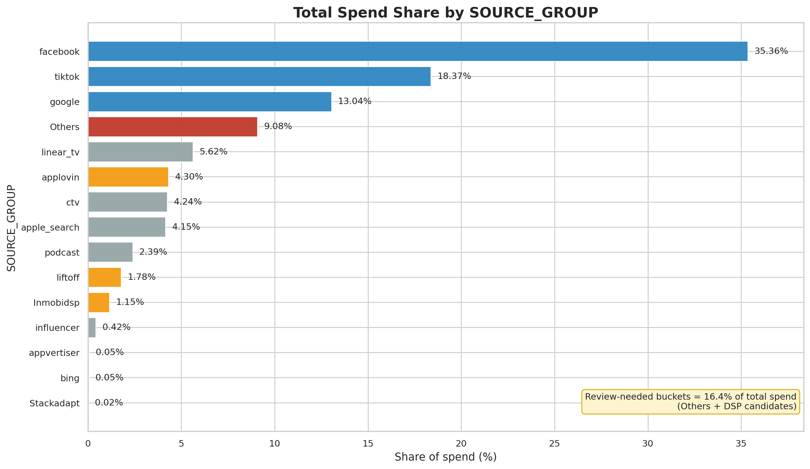
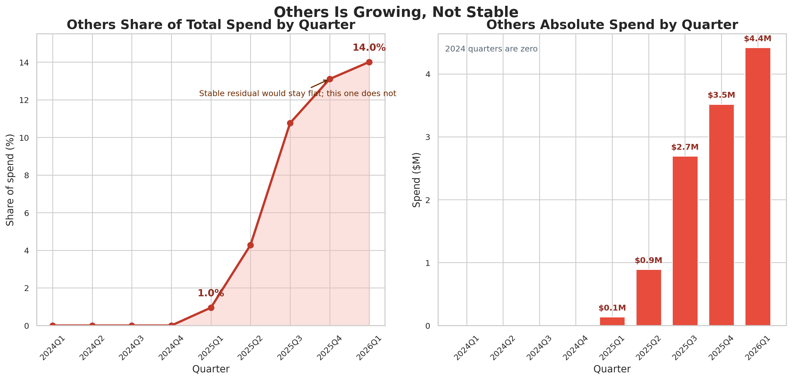
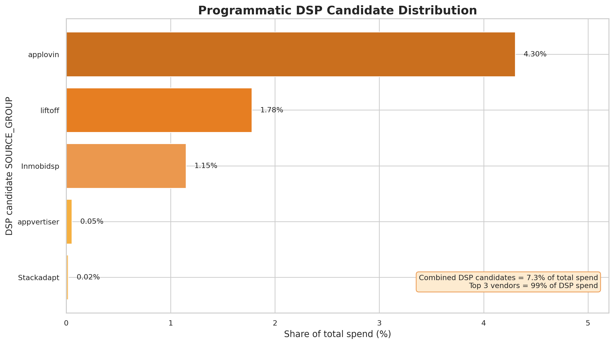
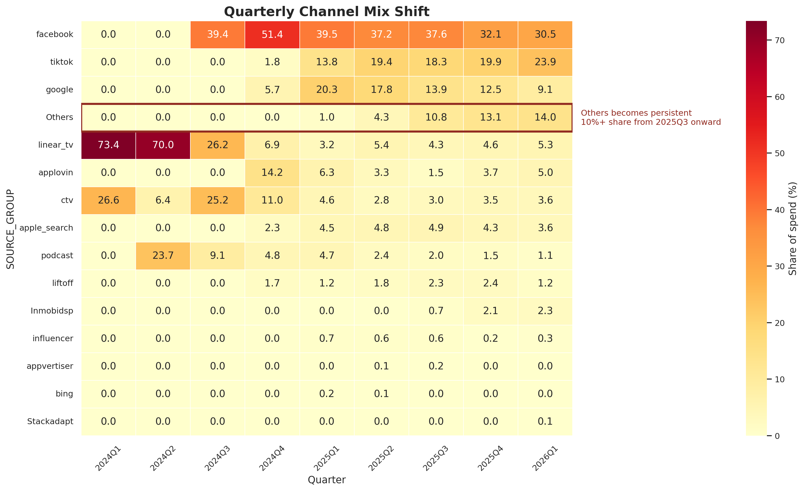

## Discussion Goal

- Share preliminary recommendations from this week
- Highlight what is resolved vs still open
- Surface the highest modeling risks
- Align on decisions needed next
- This discussion is preliminary

## What We Focused On This Week

- Framework evaluation: Meridian vs PyMC-Marketing
- SOURCE_GROUP to channel mapping exploration
- "Others" bucket behavior and risk
- Experiment quality and calibration implications
- Data-readiness items before modeling

## What We Took From Last Week

- Model at channel x platform level
- Requirement: two outputs, conversions and LTV
- Meta, TikTok, CTV tests inform calibration
- March 2026 is the modeling cutoff
- Simple regression is not the right path

## Channel Guidance From Last Meeting

- Meta stays grouped, split by platform
- DSPs should stay separate initially
- Apple stays separate
- Audio / Spotify stays separate
- "Others" depends on trend behavior

## What Is Resolved vs Open

::: {.columns}
::: {.column width="50%"}
### Resolved

- Platform fixes are defined
- LTV anomaly windows are defined
- March 2026 cutoff is defined
- Jan 2026 Meta stays in
:::
::: {.column width="50%"}
### Still Open

- Final channel taxonomy
- DSP grouping approach
- "Others" treatment
- Initial modeling aggregation choice
:::
:::

## Frameworks We Reviewed

### Finalists

- Meridian
- PyMC-Marketing

### Screened Out

- LightweightMMM: archived, unsupported
- Robyn: not our Bayesian path
- Custom PyMC: fallback only

## Meridian: Preliminary View

- Strong Bayesian MMM defaults
- Clean ROI prior workflow
- Built-in optimization support
- Better fit for simpler structure
- Less flexible if requirements expand

## PyMC-Marketing: Preliminary View

- Strong Bayesian MMM flexibility
- Better fit for custom structure
- Better response-curve options
- Easier path to raw PyMC later
- More setup and prototyping work

## Experiment Quality Matters Here

- TikTok and Meta are higher-confidence signals
- CTV is useful, but lower-confidence
- Jan 2026 Meta stays with wider uncertainty
- Meta test windows caused known conversion dips
- Framework choice should handle uneven evidence quality

## Why Experiments Affect Framework Choice

- Calibration is not a nice-to-have
- Priors need clean channel mapping
- Uneven test quality needs careful treatment
- Meta disruption periods likely require special treatment; exact approach is under evaluation
- Flexibility matters beyond base MMM setup

## Framework Recommendation

- Our current view is that PyMC-Marketing is the stronger starting point
- This suggests a better fit for the current complexity
- It keeps customization options open
- Meridian remains a credible backup
- We recommend exploring one prototype before locking selection
- Does PyMC-Marketing feel like the right prototype starting point, or would you prefer Meridian first?

## Preliminary Channel Mapping View

- Meta, TikTok, Google stay separate
- Linear TV and CTV stay separate
- Apple Search stays separate
- Podcast / Audio stays separate
- Based on the recent trend, our current view is that "Others" may need breakdown, pending alignment

## Mapping Is Blocking Modeling

- We have 15 raw SOURCE_GROUP values
- Priors attach to channels, not raw noise
- Mapping changes model dimensionality
- Mapping affects channel-platform design
- The current mapping is proposed and awaiting approval before preprocessing

## Why Mapping Matters

{width="92%"}

- Mapping ambiguity affects a meaningful share of spend, at roughly 16%
- This is not just long-tail noise, so taxonomy choices can materially affect the model

## Mapping Implication

- Does the proposed channel taxonomy direction look right?
- For the major DSP sources, would you prefer that we keep them separate initially or group them?

## "Others" Share Grew Rapidly

{width="90%"}

- "Others" share has grown by roughly 15x and is now a material part of spend
- This suggests it is no longer a small residual bucket

## What This Suggests for "Others"

- It reduces channel-level interpretability
- It weakens prior assignment
- It can distort optimization outputs
- It increases delivery risk
- Based on this, our current view is that breakdown may be needed, but we need alignment
- Given this, how would you prefer we treat "Others"?

## Data Readiness Summary

- `iso` is proposed to map to iOS
- `web and app` is proposed to map to web
- March 2026 is the final cutoff
- LTV anomaly windows are expected to be imputed
- Data is available at daily granularity; modeling resolution is a design choice
- Mapping remains the main blocker
- Since data is available daily, would you prefer we start modeling at daily or weekly aggregation?

## Preliminary Recommendations

- Our current view is to start with PyMC-Marketing as the primary path
- Data is available daily; we are evaluating the right starting aggregation
- Our current approach is to keep two separate outcome models
- Use the approved mapping before full preprocessing
- We recommend exploring whether "Others" should be broken down before modeling

## Decision Recap

- Channel taxonomy: approve current direction or revise key mappings now
- Major DSP sources: keep separate initially or group for stability
- "Others": keep as a residual bucket or break it down
- Framework starting point: PyMC-Marketing first or Meridian first
- Modeling aggregation: start weekly or daily

## Appendix: Mapping Summary

| SOURCE_GROUP | Proposed channel | Share | Status |
|---|---|---:|---|
| facebook | Meta | 35.36% | Proposed |
| tiktok | TikTok | 18.37% | Proposed |
| google | Google | 13.04% | Proposed |
| Others | Needs breakdown | 9.08% | Under review |
| linear_tv | Linear TV | 5.62% | Proposed |
| ctv | CTV | 4.24% | Proposed |
| apple_search | Apple Search | 4.15% | Proposed |
| podcast | Audio / Podcast | 2.39% | Proposed |

## Appendix: Mapping Summary

| SOURCE_GROUP | Proposed channel | Share | Status |
|---|---|---:|---|
| applovin | AppLovin (DSP) | 4.30% | Needs confirmation |
| liftoff | Liftoff (DSP) | 1.78% | Needs confirmation |
| Inmobidsp | InMobi (DSP) | 1.15% | Needs confirmation |
| influencer | Influencer | 0.42% | Proposed |
| appvertiser | Appvertiser (DSP) | 0.05% | Needs confirmation |
| bing | Bing / Microsoft | 0.05% | Needs confirmation |
| Stackadapt | StackAdapt (DSP) | 0.02% | Needs confirmation |

## Appendix: DSP Spend Is Concentrated

{width="90%"}

- The majority of DSP spend is concentrated in three vendors
- This suggests the grouping decision is focused and manageable rather than broad

## Appendix: Channel Mix Inside "Others"

{width="92%"}

- The mix appears to shift over time, which further supports reviewing whether "Others" may be masking multiple behaviors
- This is supporting context for the main-deck discussion on whether breakdown is needed

## Appendix: Experiment Facts

- TikTok and Meta tests are user-level holdouts
- CTV is a geo-based holdout
- Jan 2026 Meta was cancelled early
- Meta test windows caused conversion dips
- These periods require special treatment; exact approach is under evaluation
