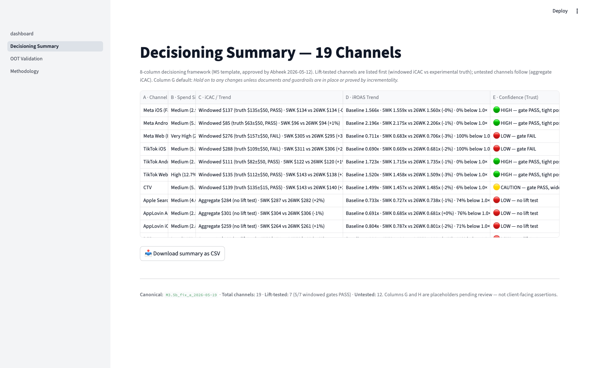
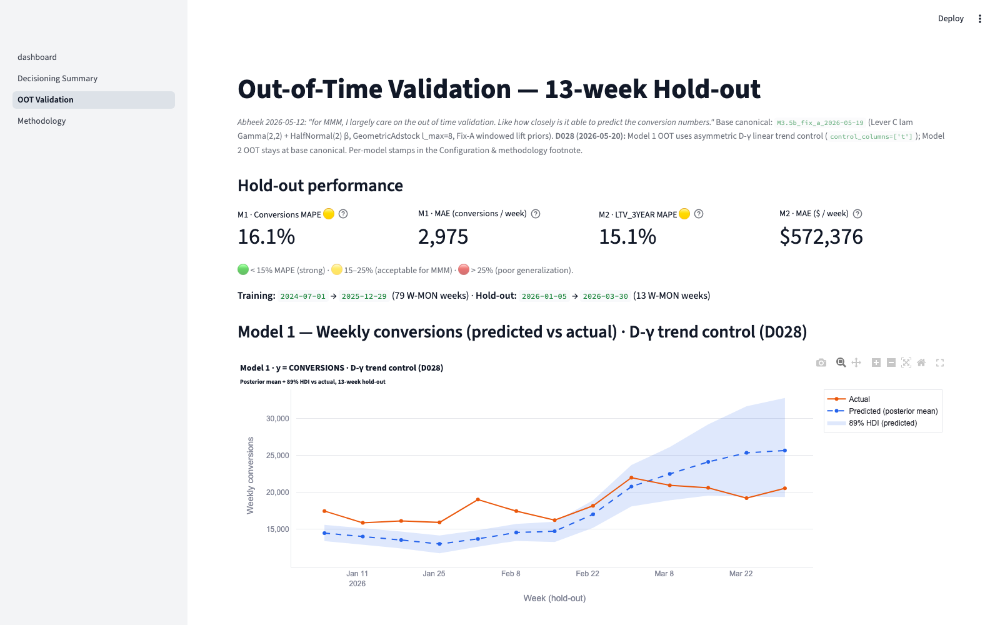
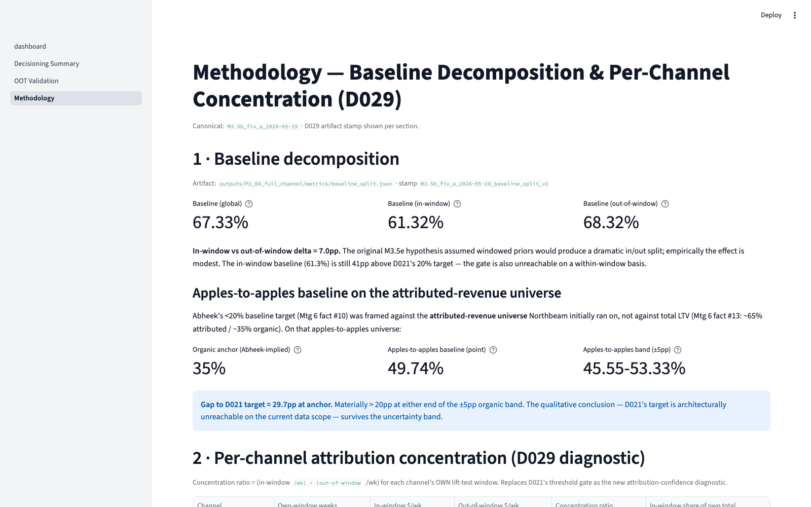

## Where we landed {.smaller}

The final results, the approach behind them, and what we tested since we last met.

. . .

| Area | Where it stands |
|---|---|
| **Out-of-time forecast** *(the metric you weigh most)* | In good shape. Conversions model 16.1% error, LTV model 15.1%, both inside the 15 to 25% band these models are held to. Earlier over-prediction is down from every hold-out week to 4 of 13. |
| **Decisioning layer** | Live. 19 channels, the 8-column framework, sortable, with a CSV export. Meta Web flagged low confidence so you know which signal to read with caution. |
| **Baseline** | Reported openly. About 67% of LTV sits in the baseline: genuine organic demand plus view-through credit that spend-only data can't recover. A lower number is reachable, but it carries a real cost. |
| **What we tested** | Two engines, a full settings sweep, a model audit, and whether broader demand and economic signals were the missing piece. The honest read: the next gains come from richer data more than from more modeling. |

. . .

This is our last working session before June 4 and 5. Today we walk through where we landed, and the one input that would drive the next iteration.

---

## Out-of-time validation {.smaller}

You've said out-of-time prediction is what matters most for an MMM, so we start there. We trained on the first 79 weeks, held out the last 13 (2026-01-05 through 2026-03-30), and predicted each week against what actually happened.

. . .

| | **Model 1, Conversions** | **Model 2, LTV (3-year)** |
|---|---|---|
| MAPE | 16.13% | 15.13% |
| sMAPE | 16.41% | 13.84% |
| Signed mean error | −3.66% | +14.96% |
| Over-prediction weeks | 4 of 13 (down from 13 of 13) | 12 of 13 |
| Convergence | R-hat 1.006, ESS 1,208, 0 divergences | R-hat 1.004, ESS 2,098, 0 divergences |

Both land inside the 15 to 25% band these models are typically held to. The conversions model used to come in high every hold-out week; that's now 4 of 13, with average error inside ±5%.

. . .

**On the "overconfident intervals" concern.** In-sample, the 89% interval covers 94.6% of weeks, and on the hold-out the full predictive interval covers all 13. The narrow 7.7% figure that may have stood out was the band around the *average* prediction only, a display choice in our report, not a problem with the model.

---

## The decisioning layer, and which signal to read carefully {.smaller}

19 channels, the 8-column framework you reviewed and approved, sortable on every column, with a CSV export so your team can slice it on their own. We'll walk it live in a moment.

. . .

The one thing to raise up front: **Meta Web is flagged low confidence.** That isn't a hedge. It's the model being clear about where its own read is weakest, so it doesn't get over-weighted in a spend decision.

. . .

| | Meta Web |
|---|---|
| Confidence flag | Low. Doesn't pass its in-window calibration check. |
| In vs. out concentration | 1.04, essentially flat |
| What that tells us | Tightening its calibration moved the cost level into range, but didn't change where the model places the credit. |

. . .

That flat 1.04 is the signature of view-through: Meta Web earns much of its credit through impressions people see but don't click, and a spend-only model can't place that credit on the channel. The low-confidence flag and the 1.04 are the same finding from two angles, the signal is genuinely uncertain, not just tied to one stretch of time.

---

## Revisiting the saturation curves {.smaller}

You flagged the cost-per-acquisition curve looked flat against spend, as a model-validity concern. We worked through it.

. . .

**What we fixed.** The curve we'd shown was the *average* cost. The spec, and your feedback, call for the *marginal* view, the cost and return on the next dollar. We rebuilt the marginal curves from the existing model, no refit, and they show real curvature, which supports your read.

. . .

**The honest limit.** Within the spend range we actually observe, the curve stays close to linear. That's a genuine finding in the data, not a rendering issue. A sharp tipping point only shows up if we extrapolate beyond observed spend (we'd label that as extrapolation) or impose a stronger-saturation assumption the data doesn't support. We tried loosening it, and it broke convergence without revealing a tipping point. So we won't draw an S-curve the data doesn't show.

. . .

**Next iteration.** Two threads for after the capstone: whether the second engine's saturation surfaces a tipping point, and why the spend-only curve stays near-linear over the range we observe.

*Corrected marginal curve is in final production for June 4 and 5, and live on the dashboard today if it's ready by meeting time.*

---

## The baseline, openly {.smaller}

Our model puts roughly 67% of LTV in the baseline, the part measured paid spend doesn't explain. Here's how it breaks down.

. . .

| Part of the ~67% | Share | Why it's there |
|---|---|---|
| Organic demand *(working anchor)* | about 35% | Not a number our model measured. We anchor it to your own attributed-revenue figure: roughly two-thirds of revenue is credited to paid, implying about one-third organic. We carry it as a borrowed reference with real uncertainty, not as established fact, since spend-only data can't verify it independently. |
| Missed paid attribution | about 32 points | Credit the model can't place on a channel, largely Meta Web view-through plus some under-instrumented channels. It lands in the baseline by default. |

. . .

**Structural because of the data, not a modeling choice.** The spend-only inputs don't contain the signal to move those conversions onto channels, so no setting recovers what isn't there. This isn't a gap attribution would close: MMM needs no user tracking, and the input that would help is aggregate exposure (impressions), which is privacy-safe.

---

## Reconciling our 67% with your other numbers {.smaller}

Different instruments give different baselines. The true number sits between them, so the useful move is to reconcile, not to force a match.

. . .

| Tool | Baseline | Why it lands there |
|---|---|---|
| Northbeam | about 12% | Blends multi-touch attribution (click, view-through, pixel-stitched tracking) with MMM. Tracking credits the trackable paid it can see, so the unexplained baseline shrinks, but it misses organic and untracked demand with no pixel trail. The 12% is the signature of tracking's blind spot, the mirror image of our spend-only one. |
| Meridian | about 30% | Sits between the two, using a different set of controls (including macro-as-trend) and the narrower attributed-revenue universe rather than total LTV. |
| Ours (MMM) | about 67% | Spend-only and privacy-durable, with no tracking. It captures the organic and offline demand that tracking misses, which tends to run higher for a subscription and credit-building business. |

. . .

Pushing ours down to match a tracking tool would mean taking on that tool's blind spots. A baseline near 67% is on the high side of normal for a retention business, not a red flag. Why ours is a sound reading, next.

---

## Why the 67% is a sound result, not an artifact {.smaller}

Ours is one instrument's reading, which is why we placed it alongside Northbeam and Meridian first. Here's why the reading itself is sound, the honest output of a spend-only approach rather than a bug we can tune away.

. . .

| Check | What it shows |
|---|---|
| Settings sweep | The baseline barely moves across the full sweep (knob-invariant). |
| Second engine | An independent engine lands in the same place (engine-invariant). |
| Blind simulation | A synthetic run with a known ~30% baseline recovered about 30% (recovers a known truth). |

Three independent checks agree: the pipeline produces the 67% faithfully. It doesn't inflate it.

. . .

**A lower number isn't free.** We can produce a baseline near 41%, but only by loosening the link to your incrementality tests. As soon as we do, out-of-time error rises into the mid-20s, CTV drifts off its tested value, and Meta Web's cost climbs back toward the level we spent several weeks bringing down. A 41% baseline that predicts worse and pulls the channels off calibration is weaker than a 67% that predicts well and keeps them honest.

. . .

Put on the same footing as your attributed-revenue universe, the baseline works out to about 50% (a point estimate near 49.7%, in a 45% to 53% range). The distance from there to a 30% to 40% target comes down to what the data can see, not a setting we can tune.

---

## What we tested since we last met {.smaller}

We didn't stop at one model. We ran four lines of work, and each was set up to try to bring the baseline down rather than to defend it.

| Line of work | What we did | What we found |
|---|---|---|
| Two engines | Built a second, independent modeling engine on the same data. If two methods disagree, the number is an artifact of one of them. | Both land around 66% to 67%. The baseline is the same regardless of engine. (One looser setting on the second engine reaches 41%, but it gives up out-of-time accuracy and channel calibration, the same trade-off above.) |
| Model settings | Swept the levers that should move the baseline: prior tightness, the untested channels' priors, the saturation curve, the intercept prior. | None of them reaches 30% to 40% without breaking calibration. When we pushed hard toward 35%, the model settled back near 60% on its own. |
| Simulation recovery | Generated synthetic data with the baseline set to a known 30%, then ran our exact pipeline on it blind. | It recovered about 30%. The pipeline doesn't inflate the baseline, so when it reports 67% on your real data, that's the data, not the method. |
| Model audit | Tested the "overconfident intervals" concern, and tried a heavier-tailed likelihood and a hierarchical structure. | The concern turned out to be a display choice, not a model issue (94.6% in-sample coverage, full coverage on the hold-out). Neither alternative helped, and pooling actually raised the baseline. |
| Demand and macro signals | Added broader demand and economic controls to see whether the baseline was missing real outside demand. | This looked promising at first, then a closer test changed the picture. The next slide walks through it. |

The thread running through all of it is that the 67% held up across everything we tried. What's left to move it is better data more than a better setting.

---

## The demand and macro signals, in full {.smaller}

This is the one we want to walk through slowly. It's a fair question, and it nearly changed our answer.

**It looked like the answer.** A consumer-demand search index alone brought the baseline from 67% to 62% and out-of-time error from 18.9% to 13.5%. Adding macro controls (the 10-year rate and consumer sentiment) took the baseline to about 49%, near the 30% to 40% target, with out-of-time error roughly halved to about 7%.

. . .

**Then we stress-tested it.** Those macro series are nearly a straight-line time trend (consumer sentiment is about 70% explained by trend alone), and a trend can relabel baseline as "demand" rather than truly explain it. We already use a trend control, so it largely duplicates one.

. . .

**The test that settled it.** We removed the trend from each series and re-fit on only the genuine, non-drift movement.

| After removing the trend | Baseline | Out-of-time error |
|---|---|---|
| Raw macro (looked great) | ~49% | ~7% |
| Genuine, de-trended signal | ~62% | ~17% |

The gain was a trend in disguise; it didn't survive.

. . .

We kept the honest 67%. The model held up even against the most promising alternative we found.

---

## Where this goes next, the one input that moves the floor {.smaller}

The modeling is exhausted: across two engines and a full settings sweep, the 67% holds. What moves it next isn't a better model, it's one input. If the next iteration goes ahead, this is where it starts.

. . .

**Channel-level impressions or reach, especially for Meta Web.** The single input that brings the baseline down honestly.

. . .

- **Why this one.** Meta Web's effect works through view-through, where people see impressions and convert later without clicking. A spend-only model can't capture that, and it's a large part of the roughly 32 points sitting in the baseline.
- **What it unlocks.** With impressions, the model can place that view-through credit on the channel directly and bring the baseline down honestly, rather than by re-labeling the way the macro test would have.
- **The mechanism is already visible.** The flat 1.04 Meta Web concentration is direct evidence that spend variation alone can't recover this credit. Impressions are the input that can.

. . .

You've described a roadmap of five to seven iterations. This is what the next one would build on, the natural next step once this work is in your hands. A secondary input, dated product, pricing, and feature-launch events, would help the same way.

---

## Live dashboard {.smaller}

`http://localhost:8501`, with 19 channels across four pages.

| Page | What's on it |
|---|---|
| Home (channel drill-down) | Cost-per-acquisition card with the posterior and truth-band overlay, a return card, time-series tabs, the saturation curve, and a model-health strip |
| Decisioning Summary | The 19-row, 8-column table, lift-tested seven on top with windowed cost vs. truth, and the untested twelve below. Sortable, with CSV export. |
| Out-of-Time Validation | Both models' prediction charts (interval vs. actuals), an accuracy strip, and per-week error tables |
| Methodology | The baseline decomposition, per-channel concentration, the view-through mechanism, and the impressions request |

We'll walk it in this order: Home on Meta iOS, then Decisioning Summary, then Out-of-Time Validation, then Methodology. Static fallbacks follow in case anything breaks.

---

## Fallback: Decisioning Summary {.smaller}

---

## Fallback: Out-of-Time Validation {.smaller}

---

## Fallback: Methodology {.smaller}

